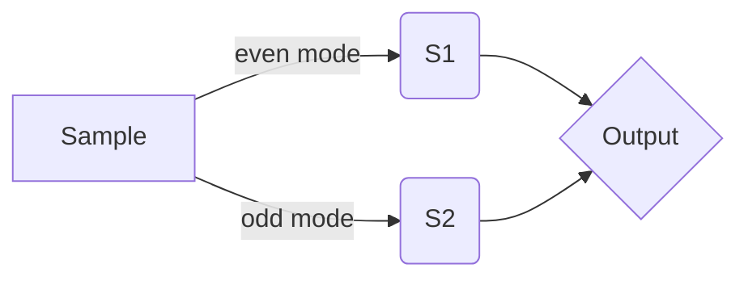

## Team Information

Team Name: Erwin's Box

Team Members:

- Shima Amirentezari Discord ID: shimaamirentezari#5121 [Github](https://github.com/QIShima) [Email](mailto:entezari.phy@gmail.com)

- Javad Sohrabi Discord ID: javadsohrabi#9135 [Github](https://github.com/javadsohrabi) [Email](mailto:javat.sohrabi@gmail.com)

- Behnam Haddadian Discord ID: To Be#8124 [Github](https://github.com/Behnam-H) [Email](mailto:behnam.h1@gmail.com)

Pitch Presenter: Behnam Haddadian

Challenge Name: [Random number generation using boson sampling](https://github.com/womanium-quantum/Random-number-generation-using-boson-sampling---ORCA-Computing)

## Resources

Following algorithms have been implemented and proposed based on [An introduction to boson-sampling](https://arxiv.org/abs/1406.6767) and [An Unbiased Quantum Random Number Generator Based on Boson Sampling](https://arxiv.org/abs/2206.02292) publication.
We have used [Perceval](https://perceval.quandela.net/docs/), a Python API, to simulate photonic circuits and the boson sampling process.
Perceval's [Perfect Boson sampling](https://perceval.quandela.net/docs/notebooks/Boson%20Sampling.html#Perfect-Boson-sampling) was used to simulate these circuit setups.

## Implementations

After studying the publications mentioned above, we implemented the initially proposed algorithm. From there, we experimented with a range of different **post-processing** and **encoding** methods to highlight the effect of circuit setup while trying to achieve better performance.

Studying the boson sampling process and random number generation, a method was proposed to study the effects of manipulating the initial algorithm's input state, which can lead to higher performance and lower the rate of loss, and as a result, improving the random number generation process. You can find more details about this algorithm [here](https://github.com/Behnam-H/Random-number-generation-using-boson-sampling---ORCA-Computing/blob/main/Studying%20the%20effect%20of%20input%20states(QRNG).pdf).

During the study, we implemented nine algorithms closely related to the initially proposed method with different setups and encoding. We checked the output performance and distribution to increase the algorithm's overall usability.

The following methods have been implemented using **Jupyter Notebooks** that can be found under [Notebooks](https://github.com/Behnam-H/Random-number-generation-using-boson-sampling---ORCA-Computing/tree/main/notebooks). Each notebooks contains one implementation in ```qrng(1000,modes=NUMBER_OF_MODES,input_mode=CHOOSE_1_OF_5)``` method. This function takes three parameters (and one optional):
1. the First parameter is the required length of bits
2. the Second parameter is the number of modes (Increasing this number results in higher run-times as it gets exponentially more CPU intensive)
3. This parameter specifies photon input mode. Five modes are available:

    - ```1```: First of modes 1s, second-half 0s. (```|1,1,...,1,0,...,0>```)

    - ```2```: Same number of photons in the first mode. (```|15,0,...,0>```)

    - ```3```: Dividing modes by 4, 3 photons for 1st quarter, two photons for the 2nd quarter, 1 photo for 3rd quarter, and 0 photons for the rest. (```|3,...,3,2,...2,1,...,1,0,...,0>```)


    - ```4```: Sending two photons for the first half of modes and 0 for the rest. (```|2,2,...,2,0,...,0>```)

    - ```5```: 1 photon for all modes. (```|1,1,...,1>```)

Implementation's output can be analyzed by the ```Evaluate()``` method, which takes the resulting distribution as a parameter and shows:

1. Distribution entropy (using python native method)

2. Distribution average value

3. Sample length (to measure algorithm requested vs. delivered number of bits)

4. Plot showing the value distribution (counts 1s and 0s) and compares that with a distribution of python generated random list.

Using **M** modes, it is possible to get **M** outputs simultaneously. On the other hand, one can generate the same output while using **<M** modes as iterations over a lower number of modes and append the result of each iteration to the output.

This method helps speed up the simulation, as increasing the number of modes results in exponentially higher run times. This method can be helpful in photonic circuit setups as this method can generate a higher number of bits with fewer modes.

----

## Implementation list
### Initial encoding

[Notebook](https://github.com/Behnam-H/Random-number-generation-using-boson-sampling---ORCA-Computing/blob/main/notebooks/initial%20method.ipynb)

||0|1|2|3|
|:--:|:--:|:--:|:--:|:--:|
|S1|0|0|1|1
|S2|0|1|0|1
|Output|*|1|0|*

### 1st proposed encoding

[Notebook](https://github.com/Behnam-H/Random-number-generation-using-boson-sampling---ORCA-Computing/blob/main/notebooks/1st%20method.ipynb)

||0|1|2|3|4|5|6|7
|:--:|:--:|:--:|:--:|:--:|:--:|:--:|:--:|:--:|
|S1|0|0|0|0|1|1|1|1
|S2|0|0|1|1|0|0|1|1
|S3|0|1|0|1|0|1|0|1
|Output|*|*|1|*|*|0|*|*

### 2nd proposed encoding

[Notebook](https://github.com/Behnam-H/Random-number-generation-using-boson-sampling---ORCA-Computing/blob/main/notebooks/2nd%20method.ipynb)

||0|1|2|3|4|5|6|7
|:--:|:--:|:--:|:--:|:--:|:--:|:--:|:--:|:--:|
|S1|0|0|0|0|1|1|1|1
|S2|0|0|1|1|0|0|1|1
|S3|0|1|0|1|0|1|0|1
|Output|*|1|*|*|*|*|0|*

### 3rd proposed encoding

[Notebook](https://github.com/Behnam-H/Random-number-generation-using-boson-sampling---ORCA-Computing/blob/main/notebooks/3rd%20method.ipynb)

||0|1|2|3|4|5|6|7
|:--:|:--:|:--:|:--:|:--:|:--:|:--:|:--:|:--:|
|S1|0|0|0|0|1|1|1|1
|S2|0|0|1|1|0|0|1|1
|S3|0|1|0|1|0|1|0|1
|Output|0|1|1|1|0|0|1|0

### 4th proposed encoding

[Notebook](https://github.com/Behnam-H/Random-number-generation-using-boson-sampling---ORCA-Computing/blob/main/notebooks/4th%20method.ipynb)

||0|1|2|3|4|5|6|7
|:--:|:--:|:--:|:--:|:--:|:--:|:--:|:--:|:--:|
|S1|0|0|0|0|1|1|1|1
|S2|0|0|1|1|0|0|1|1
|S3|0|1|0|1|0|1|0|1
|Output|1|1|1|0|0|0|0|1

### 5th proposed encoding

[Notebook](https://github.com/Behnam-H/Random-number-generation-using-boson-sampling---ORCA-Computing/blob/main/notebooks/5th%20method.ipynb)

| | 0| 1| 2| 3|
|:--:|:--:|:--:|:--:|:--:|
|S1|0|0|1|1
|S2|0|1|0|1
|Output|0|1|0|1

### 6th proposed encoding

[Notebook](https://github.com/Behnam-H/Random-number-generation-using-boson-sampling---ORCA-Computing/blob/main/notebooks/6th%20method.ipynb)

Using the initially implemented encoding, separating sample results based on the mode in which sampling occurs leads to interesting results.


The resulting distribution changes with each run without a constant bias and very high performance.

### 7th proposed encoding

[Notebook](https://github.com/Behnam-H/Random-number-generation-using-boson-sampling---ORCA-Computing/blob/main/notebooks/7th%20method.ipynb)

||0|1|2|3|4|5|6|7
|:--:|:--:|:--:|:--:|:--:|:--:|:--:|:--:|:--:|
|S1|0|0|0|0|1|1|1|1
|S2|0|0|1|1|0|0|1|1
|S3|0|1|0|1|0|1|0|1
|Output|*|1|1|1|0|0|0|*

### 8th proposed encoding

[Notebook](https://github.com/Behnam-H/Random-number-generation-using-boson-sampling---ORCA-Computing/blob/main/notebooks/8th%20method.ipynb)

| | 0| 1| 2| 3|
|:--:|:--:|:--:|:--:|:--:|
|S1|0|0|1|1
|S2|0|1|0|1
|Output|0|1|1|0

> Simulations showed that this encoding's value distribution is biased towards 0.
>
> Increasing the number of modes reduces the bias.
----
## Possible usages
- Creating Encryption keys
- Generating test cases during simulation to find points of failure
- Picking lottery winner
- Monte Carlo simulation
- Cosmological simulations
- QRNG based cryptocurrencies
- ...

## Conclusion

Because of the chosen post-processing method proposed in [An Unbiased Quantum Random Number Generator Based on Boson Sampling](https://arxiv.org/abs/2206.02292) the simulation showed ~50% data loss, and experiments highlighted the impact of chosen setup, including **modes** and **circuit input state** which can have a significant effect on the output distribution.

Based on the proposed method, the initial setup may generate evenly distributed values or biased random numbers. Also, different post-processing methods can impact the performance and the loss percentage.

As observed in the simulations above, the chosen number of modes or a lousy encoding can lead to biased results. If the selected encoding method is not flawed, it impacts algorithm performance.

It is worth mentioning that having an evenly distributed output may not necessarily be a sound output. This kind of distribution eliminates the possibility of getting many 1s or 0s in the output, which narrows down the output cases and may not be ideal.

## To do

- Examine provided algorithms on Quantum Hardware.
- Study the effect of gate parameters on getting the desired output.
- Study ways to improve algorithm performance and decrease loss.
- Study the predictability of the proposed algorithms.
- Studying gate parameters can result in an algorithm that may be used to calibrate a biased setup.
